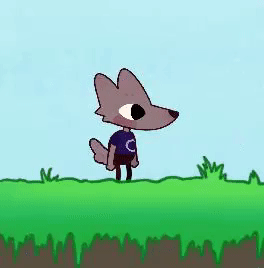

# Unity2D-WolfGameExample
This is a simple 2D platformer game designed as a base for VGDC members new to game development to work off of. Runs on Unity 2022.3.8f1, but should be able to upgrade to newer versions.

Play the demo [here](https://vgdcncsu.itch.io/2d-platformer-demo-game)
## The Game Contains:

* A simple platformer character
* Level geometry that can be edited
* An enemy that will throw obstacles at the player that can be defeated by jumping on its head
* death planes
* obstacles
* In game menus

In the project there is a sample level that shows how all these different parts can be put together to make a game level. To make your own, you can create a new scene or duplicate the sample level. You can find prefabs, or premade objects, of all the objects you need to make a level in the Assets->Prefabs->Level Design folder.

Make sure to drag a player in the scene, then feel free to add whatever else you want for your level!

## Moving Forward
Feel free to edit this project however you like, or even use it as a base for any of our VGDC game jams!

